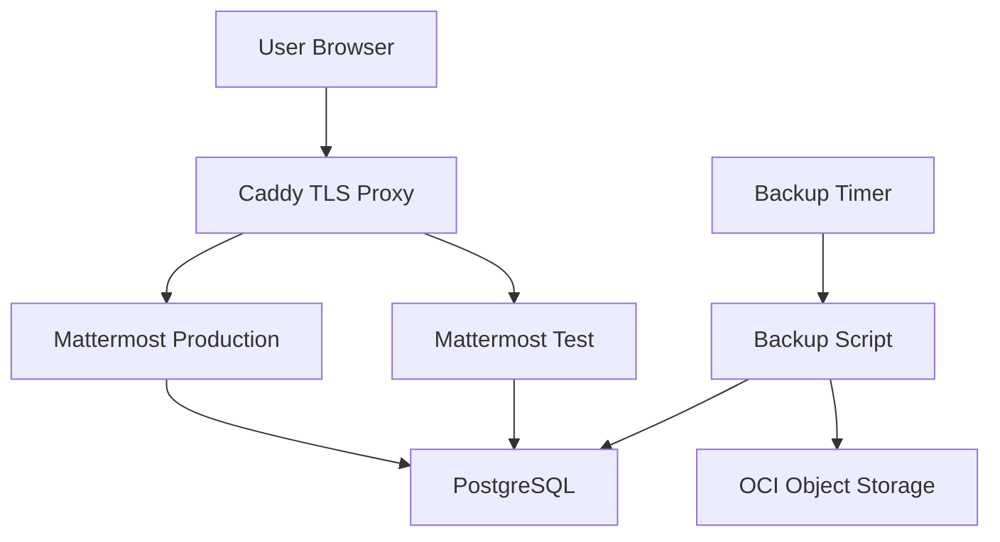

# 00 - Architecture

This deployment is designed for a small Mattermost installation on OCI Free Tier resources. It prioritizes reproducibility, understandable operations, and a narrow public attack surface over high availability.

## Components

- OCI OpenTofu stack provisions networking, compute, Object Storage, dynamic group, and IAM policy.
- Ubuntu 24.04 ARM64 VM runs Docker Engine and the Docker Compose plugin.
- Docker Compose starts PostgreSQL, Mattermost production, Mattermost test, and Caddy.
- Caddy terminates TLS, routes production traffic, and restricts test traffic by source CIDR.
- Mattermost is built locally from the official ARM64 release tarball.
- OCI Object Storage stores backup snapshots under `daily/<timestamp>/`.
- Systemd timers run backup and health checks.

## Data Flow

## Network Boundaries

- Public: SSH from admin CIDR, HTTP/HTTPS through Caddy, and Mattermost Calls UDP `8443`.
- Internal Docker network: Mattermost app HTTP on `8000/tcp` and PostgreSQL on `5432/tcp`.
- PostgreSQL and Mattermost app HTTP are not published directly on the host.

## Operational Model

- `scripts/deploy-from-zero.sh` is the primary deployment entry point.
- `/opt/mattermost` is the default application directory on the VM.
- Docker Compose project name defaults to `mattermost`.
- `.env` is rendered from OpenTofu outputs plus local generated secrets.
- DNS updates remain a manual checkpoint; DuckDNS is one simple option.

## Tradeoffs

- Single VM means upgrades and restores can be disruptive.
- Local image builds avoid registry credentials but add build time.
- Manual DNS keeps the workflow provider-neutral but requires operator confirmation.
- The test instance provides upgrade/restore validation without requiring another VM.

## Design decisions

Why this stack looks the way it does:

| Decision | Choice | Rationale |
|----------|--------|-----------|
| Orchestration | Docker Compose, not Kubernetes | Single VM, one operator; K8s adds cost and complexity without HA on Free Tier |
| Mattermost image | Build ARM64 tarball on the VM | No registry credentials; matches OCI Ampere shape |
| Test instance | Second Compose service on same VM | Upgrade/restore drills without a second VM; idle when not in use ([14-performance.md](14-performance.md)) |
| Search | Bleve (built-in) | Sufficient for small communities; avoids Elasticsearch RAM on Free Tier |
| Alerts | Mattermost incoming webhook (`ALERT_WEBHOOK_URL`) | Same chat server for ops notifications; no Slack dependency |
| IaC | OpenTofu | Reproducible OCI networking, compute, Object Storage, IAM |
| TLS | Caddy automatic HTTPS | Simple reverse proxy; auto-updated separately from Mattermost |
| Community access model | Invite-only; teams/channels in UI | DM/call policy is a deliberate operator choice ([community-channel-policy.md](community-channel-policy.md)) |
